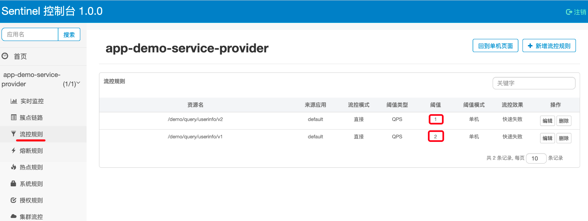
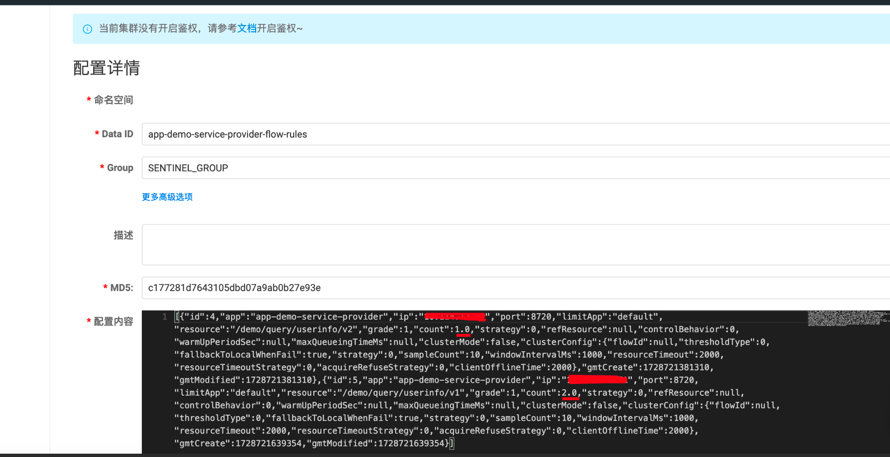

# Sentinel 控制台(桥接模式)

## 0. 概述

本方案旨在尽可能少得变更官方原模块，以便于长期的迭代升级，避免对原模块的重复改造、测试工作。

以下是工程结构和定位：<br/>
__ sentinel-dashboard-datasource<br/>
&nbsp; |__ sentinel-dashboard (jar) <br/>
&nbsp; |__ sentinel-dashboard-datasource-nacos (jar) <br/>
&nbsp; |__ sentinel-dashboard-bridge（boot）<br/>

- sentinel-dashboard 是拷贝来自官方原模块，在本方案中视为后端模块，作为被依赖的jar包。<br/>
- sentinel-dashboard-datasource-nacos 是基于扩展机制实现配置持久化的模块。如：sentinel流控、熔断降级规则，作为被依赖的jar包。<br/>
- sentinel-dashboard-bridge 是真正构建和部署的控制台应用。其主要作用是前端模块，链接持久化模块。作为执行应用软件包。<br/>

## 1. 实现过程（仅应用，请忽略该章节）

### 1.1 sentinel-dashboard
- 复制官方原模块 <br/>
- 仅在原官方模块，pom.xml中添加：<br/>
```xml
  <!--移除资源模块，将原boot打包成纯粹的jar-->
  <plugin>
    <groupId>org.apache.maven.plugins</groupId>
    <artifactId>maven-jar-plugin</artifactId>
    <executions>
        <execution>
            <goals>
                <goal>jar</goal>
            </goals>
            <phase>package</phase>
            <configuration>
                <classifier>backend</classifier>
                <excludes>
                    <exclude>**/resources/**</exclude>
                </excludes>
            </configuration>
        </execution>
    </executions>
</plugin>
```
- 执行构建打包成可被依赖的jar包: <br/>
```xml
    <dependency>
        <groupId>com.alibaba.csp</groupId>
        <artifactId>sentinel-dashboard</artifactId>
        <classifier>backend</classifier>
        <version>${sentinel.version}</version>
    </dependency>
```

### 1.2 sentinel-dashboard-datasource-nacos （其他如：Apollo、consul等动态配置能中间件类似）
- 新建模块。 <br/>
- 添加依赖`com.alibaba.csp:sentinel-dashboard:backend`和`com.alibaba.csp:sentinel-datasource-extension`，采用官方扩展机制DynamicRuleProvider和DynamicRulePublisher实现动态规则的发布和查询，此模块运用Nacos持久化存储。<br/>
- 定义并实现Controller为应用预设资源访问入口，并运用DynamicRuleNacosProvider和DynamicRuleNacosPublisher。参考：[官方集群持久化扩展机制](https://github.com/alibaba/Sentinel/wiki/Sentinel-%E6%8E%A7%E5%88%B6%E5%8F%B0%EF%BC%88%E9%9B%86%E7%BE%A4%E6%B5%81%E6%8E%A7%E7%AE%A1%E7%90%86%EF%BC%89#%E8%A7%84%E5%88%99%E9%85%8D%E7%BD%AE) <br/>
- 执行构建打包成可被依赖的jar包:<br/>
```xml
    <dependency>
        <groupId>com.sirius.to</groupId>
        <artifactId>sentinel-dashboard-datasource-nacos</artifactId>
        <version>1.0.0-SNAPSHOT</version>
    </dependency>
```

### 1.3 sentinel-dashboard-bridge
- 新建模块。 <br/>
- 依赖`com.alibaba.csp:sentinel-dashboard:backend`和`com.sirius.to:sentinel-dashboard-datasource-nacos`，使得该模块具备动态规则持久化和原控制台所有"后端"能力。<br/>
- 复制原官方模块下 `resources` 和 `webapp`，使得该模块具备参数配置和web应用能力。<br/>
- 改造`webapp`，使得该模块正确接入Controller(如：`DegradeControllerV3`、`FlowControllerV3`等)资源。<br/>
- 构建打包成可执行的boot包（应用软件包）: <br/>
```xml
    <plugin>
        <groupId>org.springframework.boot</groupId>
        <artifactId>spring-boot-maven-plugin</artifactId>
        <version>${spring.boot.version}</version>
        <configuration>
            <fork>true</fork>
            <mainClass>com.alibaba.csp.sentinel.dashboard.DashboardApplicationX</mainClass>
        </configuration>
        <executions>
            <execution>
                <goals>
                    <goal>repackage</goal>
                </goals>
            </execution>
        </executions>
    </plugin>
```

## 2. 编译和启动

### 2.1 如何编译&打包

```bash
mvn clean package
```

### 2.2 如何启动

使用如下命令启动编译后的控制台：

```bash
java -Dserver.port=8722 \
-Dcsp.sentinel.dashboard.server=localhost:8723 \
-Dnacos.server.addr=127.0.0.1 \
-Dnacos.server.port=8848 \
-Dproject.name=sentinel-dashboard \
-jar target/sentinel-dashboard-bridge-1.0.0-SNAPSHOT.jar
```

### 2.3 如何访问

```html
http://localhost:8722/#/dashboard/home
```

### 2.4 展示
